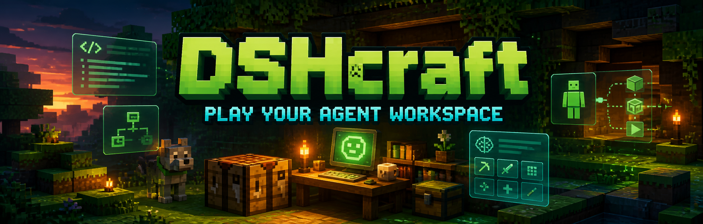
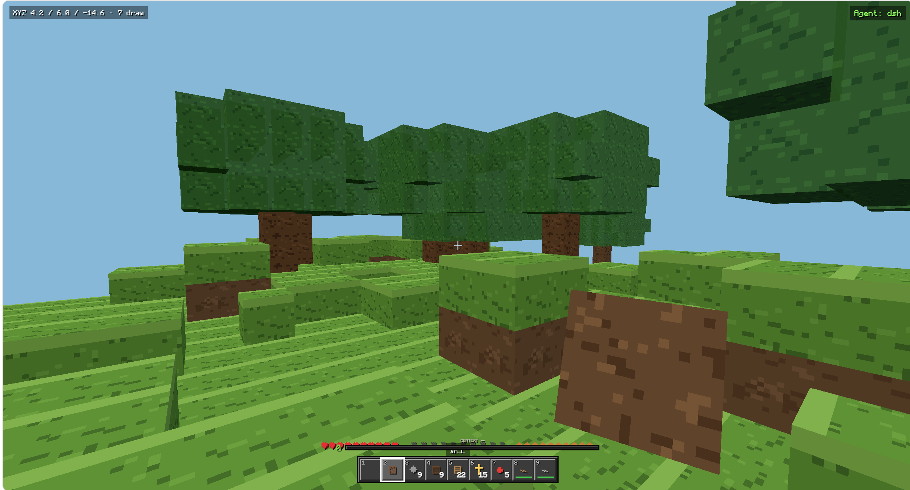
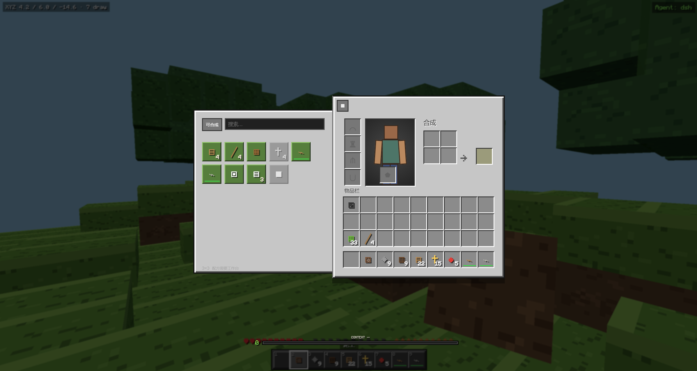
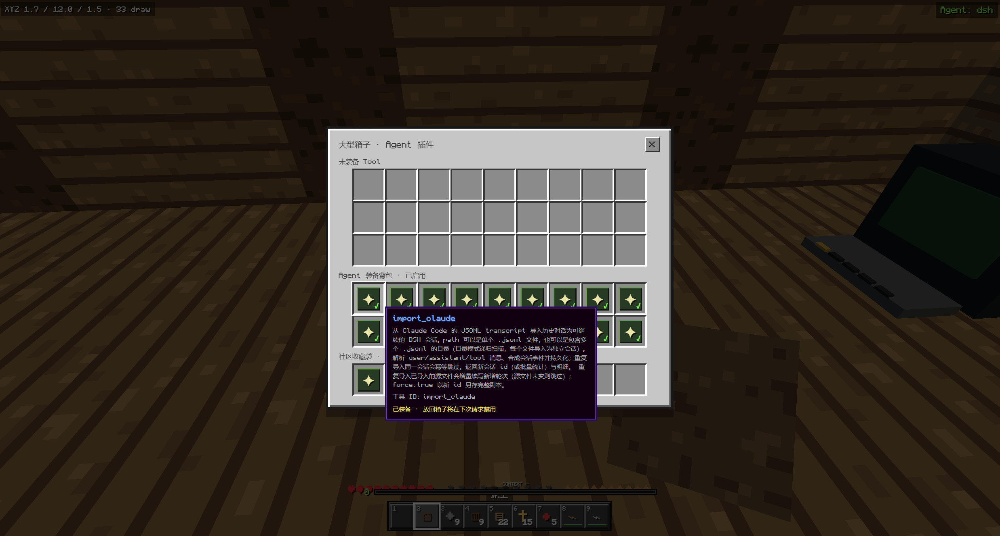
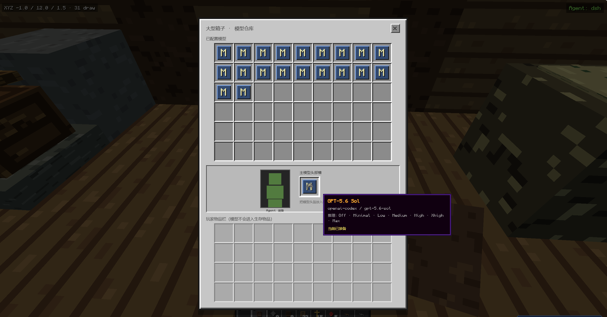
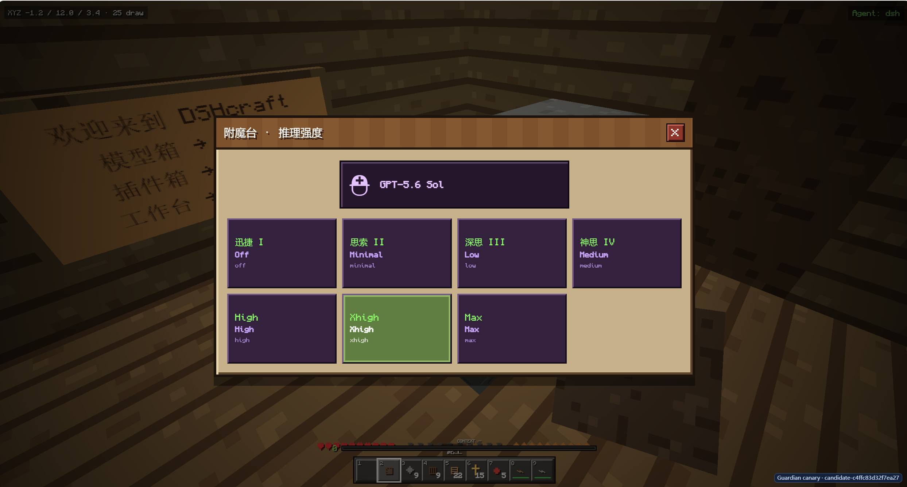
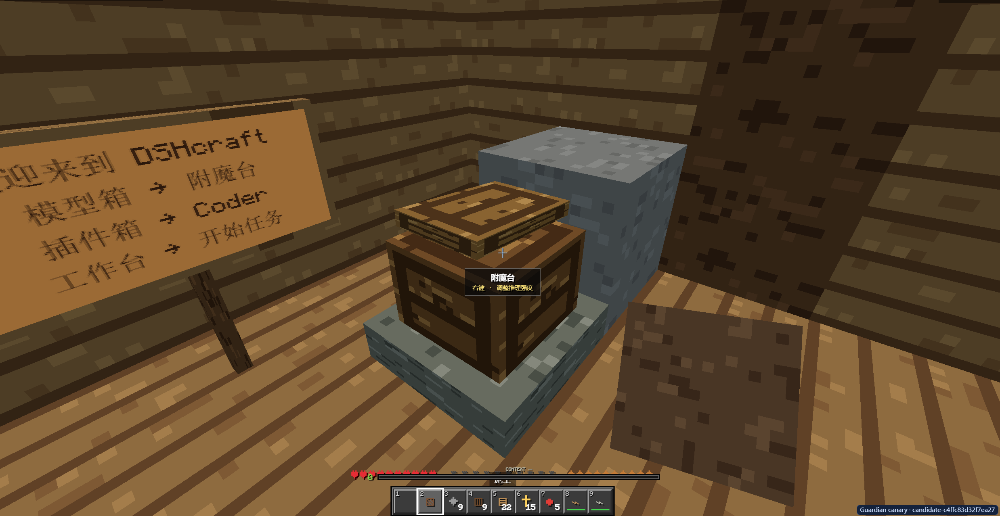

<p align="center">
  
</p>

[](https://www.npmjs.com/package/dsh-minecraft-ui) [](https://www.bilibili.com/video/BV1d48c6BEPj) [](https://www.ifdian.net/item/1a20ed042f0711f1865a52540025c377) [](https://www.creem.io/payment/prod_1yc40mIhKwwrc7iqFOG9G2) [](https://github.com/TFboy1/dsh-minecraft-ui/stargazers) [](../LICENSE)

[](https://github.com/TFboy1/dsh-minecraft-ui/actions/workflows/ci.yml) [](https://www.npmjs.com/package/dsh-minecraft-ui) [](#überblick) [](https://threejs.org/) [](https://react.dev/) [](https://nodejs.org/)

[](../README.md) [](./README_EN.md) [](./README_JA.md) [](./README_FR.md) [](#)

<p align="center">
  Verwandle DeepSeek Harness in einen spielbaren, Minecraft-inspirierten Agent-Arbeitsbereich.<br>
  <sub>Erkunde eine Voxelwelt · Rüste Modelle aus · Verzaubere den Reasoning-Aufwand · Erlebe Abenteuer mit aktiven Agents</sub>
</p>

## Installation

DSHcraft ist ein offizielles Kombinationspaket, das sowohl `dsh.bundle` als auch `dsh.client` deklariert. Nach der Installation stellt es die stabile Cordis-Zeile `minecraft-ui` bereit; seine Browser-Modulidentität lautet `dsh-minecraft-ui`.

Aktiviere einen Release Candidate nicht direkt im produktiv genutzten Web-profile. Installiere ihn zuerst in einem isolierten Canary-profile, prüfe die Kompositionsebene und führe ihn anschließend durch den Guardian-Ablauf stage / canary / promote.

### npm (empfohlen)

```bash
dsh plugin --profile <canary> add dsh-minecraft-ui
dsh --profile <canary> --dump-config
```

### Lokales Tarball

```bash
pnpm install
pnpm run verify
pnpm pack
dsh plugin --profile <canary> add ./dsh-minecraft-ui-0.3.0.tgz
dsh --profile <canary> --dump-config
```

### Git-Commit festschreiben

```bash
dsh plugin --profile <canary> add github:TFboy1/dsh-minecraft-ui#<commit-sha>
```

Bei einer Git-Installation wird der `prepare`-Build ausgeführt. pnpm 10+ verlangt eine ausdrückliche Freigabe dieses Installationsskripts. Erlaube nur vertrauenswürdigen Quellcode und konfiguriere `allowBuilds: dsh-minecraft-ui` mit dem exakten Paketschlüssel, den DSH ausgibt. Verwende das vorgefertigte npm-Paket oder ein Tarball, wenn du keine Build-Berechtigung zur Installationszeit erteilen möchtest.

Deinstallation:

```bash
dsh plugin --profile <canary> remove dsh-minecraft-ui
```

## Überblick

DSHcraft implementiert die Chat-Oberfläche nicht neu. Als Cordis Client Plugin wird es in das offizielle `shell.overlay` eingebunden und behält die nativen DSH-Komponenten Workspace, Session, Conversation, Trajectory, Composer, Berechtigungen, Modellauswahl und Kontextstatistiken bei. Lediglich Zugang, räumliche Metapher und visuelle Darstellung werden in eine Blockwelt verwandelt.

## Oberflächenvorschau

<p align="center">
  <a href="https://www.bilibili.com/video/BV1d48c6BEPj"><strong>▶ Vollständige DSHcraft-Videodemonstration auf Bilibili ansehen</strong></a>
</p>

<table>
  <tr>
    <td align="center" width="50%"><strong>Spielbare Voxelwelt</strong><br></td>
    <td align="center" width="50%"><strong>Inventar und Crafting</strong><br></td>
  </tr>
  <tr>
    <td align="center" width="50%"><strong>Agent-Plugintruhe</strong><br></td>
    <td align="center" width="50%"><strong>Modelllager</strong><br></td>
  </tr>
  <tr>
    <td align="center" width="50%"><strong>Reasoning-Verzauberungen</strong><br></td>
    <td align="center" width="50%"><strong>Semantische Einrichtungen</strong><br></td>
  </tr>
</table>

## Zentrale Metaphern

| DSH-Konzept | Darstellung in DSHcraft |
| --- | --- |
| Laufende Arbeit | Ein arbeitender Hund im Gebäude |
| Neuester Agent-Fortschritt | Statusschild über dem Hund |
| Model | Ausrüstung |
| Reasoning effort | Verzauberung |
| Tool / Plugin capability | Gegenstände in Truhen |
| Chat / Composer | Werkbank |
| Context / Token | Erfahrungsleiste und Inventardruck |
| Memory | Langzeitspeicher-Metapher im Stil einer Endertruhe (vorgemerkt) |
| MCP | Redstone-System (vorgemerkt) |
| Workspace / Project | Karte und Kartentisch |
| Community Plugin | Statische Community-Beutetruhen in der Welt |

## Funktionen

### Blockwelt

- Ego-Voxelwelt auf Basis von Three.js.
- Bewegen, springen, sprinten, schleichen, abbauen, Blöcke platzieren und Schnellleiste wechseln.
- Weltunterschiede, Spielerposition, Inventar, Truhen und Auswahlstatus werden gespeichert.
- Zerstörte Blöcke werden zu Welt-Drops mit Herausspringen, Fallen, Rotation, Aufnahmeverzögerung und automatischer Nahaufnahme.
- Ist das Inventar voll, bleibt die nicht aufgenommene Restmenge in der Welt.

### Native DSH-Werkbank

Drücke `G` oder benutze die Werkbank im Gebäude, um die Minecraft-inspirierte native DSH-Oberfläche zu öffnen:

- Workspace- / Project-Ordner auf- und zuklappen sowie sortieren.
- Sessions erstellen, öffnen, umbenennen, forken und archivieren.
- Native Conversation- / Trajectory-Ansichten und Verlaufspaginierung verwenden.
- Native Composer-, Queue-, Steer-, Stop-, Slash-Command- und Anhangslogik beibehalten.
- Native Berechtigungsmodi, Freigaben, Modelle, Reasoning-Aufwand sowie Context- und Token-Statistiken beibehalten.
- Zusätzliches 3×3-Craftingfeld, ohne die native Konversation zu ersetzen.

### Arbeitende Hunde

- Hunde entstehen nur für **aktuell laufende Arbeit**; inaktive Sessions erzeugen keine Kreatur.
- Ein Hund entspricht einer aktiven Session-Aufgabe.
- Das Statusschild zeigt Gedanken, Antwortstream, Tool Calls, Befehle, Warteschlangen, Freigabewarten, Fehler und Kontextkomprimierung.
- Tool Calls führen den Hund zur passenden Einrichtung: Read → Bücherregal, Command → Agent-Terminal, Web Search → Kartentisch, Write / Edit → Werkbank.
- Ein Rechtsklick auf den Hund wechselt zu seiner Session und öffnet direkt die native Werkbank.

### Semantische Einrichtungen

| Einrichtung | Funktion | Taste |
| --- | --- | --- |
| Werkbank | Native DSH-Konversation und 3×3-Crafting | `G` |
| Modelltruhe | Modelle anzeigen und ausrüsten | `M` |
| Plugintruhe | Werkzeuge des aktuellen Agents verwalten | `P` |
| Verzauberungstisch | Reasoning-Aufwand anpassen | `R` |
| Kartentisch | Workspace- / Project-Karten durchsuchen | `N` |
| Community-Plugintruhe | Community-Katalog erkunden | `L` |
| Referenzregal | Aktivitätsort für Read-Werkzeuge | — |
| Agent-Terminal | Aktivitätsort für Command-Werkzeuge | — |
| Hinweistafel | Steuerungstutorial | — |

Zerstörte Einrichtungen lassen sich als Gegenstand aufnehmen und erneut platzieren. Zentrale Inneneinrichtungen, die durch fehlerhafte frühe Drop-Regeln verloren gingen, werden in alten Spielständen einmalig wiederhergestellt.

## Steuerung

| Eingabe | Aktion |
| --- | --- |
| `W A S D` | Bewegen |
| `Space` | Springen |
| `Ctrl` | Sprinten |
| `Shift` | Schleichen |
| Mausbewegung | Umsehen |
| Linke Maustaste halten | Blöcke abbauen |
| Rechte Maustaste | Block, Einrichtung oder Hund benutzen |
| Mittlere Maustaste | Zielblock auswählen |
| Mausrad / `1`–`9` | Schnellleistenplatz wechseln |
| `E` | Inventar |
| `F` | Mit Nebenhand tauschen |
| `T` | Chat im Spiel |
| `Tab` | Session-Liste |
| `Esc` | Spielmenü |
| `G` | Native Werkbank |
| `M` | Modelltruhe |
| `P` | Plugintruhe |
| `R` | Verzauberungstisch |
| `N` | Workspace-Karte |
| `L` | Community-Plugintruhe |

Nach dem ersten Klick fordert der Browser Pointer Lock an. Beim Öffnen einer Einrichtung wird die Maus sofort freigegeben.

## Konfiguration

Das Bundle liefert sichere Standardwerte. In einem späteren Patch des gewählten profiles kann die stabile Zeile `minecraft-ui` überschrieben werden:

```yaml
- id: minecraft-ui
  config:
    dataDirectory: dshcraft
    catalogUrl: https://awesome-dsh-plugin.com/plugins.json
    catalogCacheTtlMs: 21600000
    catalogLimit: 2000
    confirmationTtlMs: 60000
```

| Feld | Standard | Beschreibung |
| --- | ---: | --- |
| `dataDirectory` | `dshcraft` | Sicheres relatives Verzeichnis in `$DSH_HOME` |
| `catalogUrl` | Community-Katalog-URL | Nur HTTP(S) |
| `catalogCacheTtlMs` | `21600000` | Cache-Dauer des Katalogs |
| `catalogLimit` | `2000` | Maximale Einträge, Bereich 1–5000 |
| `confirmationTtlMs` | `60000` | Gültigkeitsdauer eines Bestätigungstokens |

Cordis validiert die Konfiguration mit Schemastery und ergänzt Standardwerte. Ungültige Pfade, Protokolle oder Zahlenbereiche führen bei der Aktivierung sofort zu einem Fehler.

## Sicherheit für Community-Plugins

Community-Plugins folgen dem Ablauf Entdecken → Sammeln → Prüfen → Ausdrücklich bestätigen. Das Ergebnis ist immer ein **dry-run**. DSHcraft startet niemals selbst die CLI und verändert kein profile. Kandidaten müssen durch Guardian stage, in einem isolierten Canary geprüft und anschließend vom Benutzer zur Promotion freigegeben werden.

## Architektur

```text
dsh-minecraft-ui/
├─ src/index.js                    # Host-Plugin, Config, RPC und Persistenz
├─ cordis.patch.yml                # Kompositionsebene von dsh.bundle
├─ client/src/index.jsx            # shell.overlay-Registrierung und Styles
├─ client/src/game-root.jsx        # DSH-Zustandsbindung und Game-UI
├─ client/src/engine.js            # Three.js-Welt, Interaktionen, Drops, Hunde
├─ client/src/world.js             # Gelände, Gebäude, Blöcke, Migrationen
├─ client/src/inventory/           # Crafting-, Container- und Inventarzustand
├─ client/src/dsh/                 # Session-Projektionen und Tool-Routing
├─ client/src/ui/                  # Werkbank, Truhen, Karte und HUD
├─ scripts/build.mjs               # Deterministischer Host- / Client-Build
├─ lib/index.js                    # Gebauter Host-Einstiegspunkt
├─ lib/client.js                   # lazy-CJS-Browserbundle
└─ test/                           # Node-test-runner-Tests
```

Der offizielle DSH Root und AppFrame bleiben Eigentümer von Sidebar, Conversation, Details und Composer. DSHcraft registriert lediglich ein reversibles Welt-Overlay. Dadurch werden Session und Conversation nicht doppelt in einem zweiten React Root gemountet; Entwürfe, Anhänge, Streamingzustand und Session-Lebenszyklus bleiben konsistent.

## Entwicklung

Voraussetzungen: Node.js 22+, pnpm 11+ und eine funktionierende DeepSeek-Harness-Web-Umgebung.

```bash
pnpm install
pnpm test
pnpm run build
pnpm run package:check
pnpm run verify
pnpm pack --dry-run
```

Führe nach Änderungen am Client-Quellcode erneut `pnpm run build` aus. Die manuelle Frontend-Prüfung erfolgt in einem isolierten Canary-profile.

## Persistenz

```text
$DSH_HOME/dshcraft/capabilities.json
$DSH_HOME/dshcraft/community.json
$DSH_HOME/dshcraft/community-cache.json
```

Welt-, Spieler- und Inventardaten werden vom Persistenzdienst des Spiels verwaltet. Bearbeite DSH-Session-Protokolle nicht direkt.

## Bekannte Einschränkungen

- Die Interaktion ist für Tastatur und Maus ausgelegt; ein Touch-Spielmodus wird nicht unterstützt.
- Dies ist ein räumliches DSH-Theme und ein Client, keine vollständige Minecraft-Implementierung.
- Ist der Community-Katalog nicht erreichbar, wird auf Cache oder eingebaute Kandidaten zurückgegriffen.
- Einige Einrichtungen sind semantische DSH-Abbildungen und verhalten sich nicht exakt wie originale Minecraft-Blöcke.
- Das Client-Bundle enthält Three.js und eingebettete Schriftarten und besitzt ein ausdrückliches Größenbudget unter 2 MB.

## Lizenz

Der Projektcode steht unter der [MIT-Lizenz](../LICENSE).

Als Pixelschrift wird Monocraft verwendet; ihre Lizenz liegt unter [`licenses/Monocraft-LICENSE.txt`](../licenses/Monocraft-LICENSE.txt). Minecraft ist eine Marke von Mojang Studios. Dieses Projekt ist weder mit Mojang Studios noch mit Microsoft verbunden.
